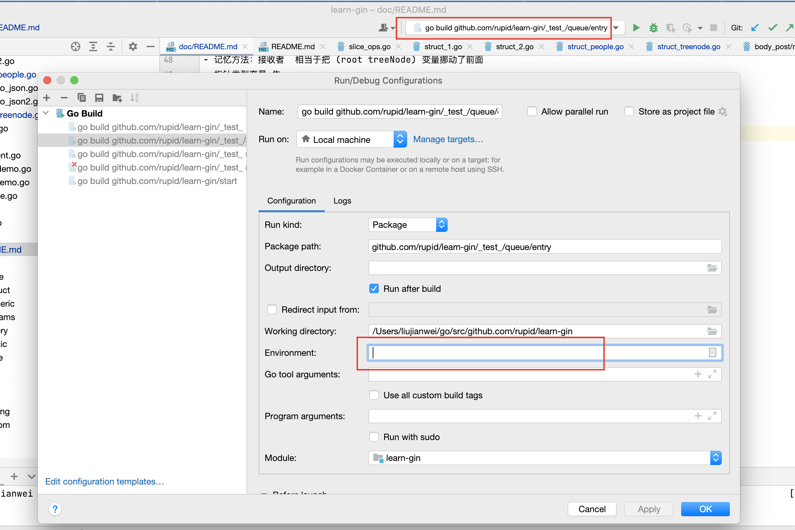
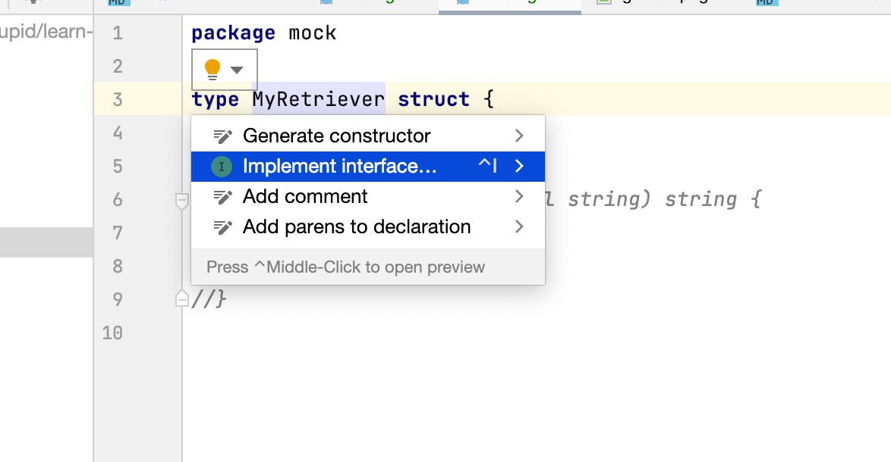

###函数语法要点回顾
func_demo.go

- 返回值类型写在最后面
- 可返回多个值 ，返回值名称和方式，快捷键
- 函数作为参数 func(args... int)反射
- 没有 默认参数，可选参数，不花哨

### 指针

```go
var  a int =2
// *int 指针类型
var pa *int=&a
//*pa 就是a变量
*pa=3
fmt.Printlin(a)
```

- 指针不能运算
- 参数传递 go 语言只有值传递一种方式 基本数据类型，切片，map，channel，自定义类型

### 切片

向后拓展，容量大小注意

```go
	//slice是对数组的view
	var arr = [...]int{0, 1, 2, 3, 4, 5, 6, 7, 8, 9, 10}
	s1 := arr[2:6] //[2,3,4,5]
	s2 := s1[3:5]  //[5,6] 注意这个结果
	fmt.Println(arr)
	fmt.Printf("s1=%v, len(s1)=%v, cap(s1)=%v \n", s1, len(s1), cap(s1))
	fmt.Printf("s2=%v, len(s2)=%v, cap(s2)=%v \n", s2, len(s2), cap(s2))
	// 容量 一直到数组最后，试着修改数组的arr的值，可以看到容易在发生发变化
	//	slice可以向后拓展，不是向前扩展
	//  s[i] 不可逾越len(s),向后拓展不可以超越底层数组cap(s)
```

- 添加元素时超宇 cap，系统会重新分配更大的底层数据，2 倍关系，原来的数组会默认被垃圾回收
- append 必须接受返回值

### map

- 初始化
- 赋值，修改
- 是否存在 ok
- 删除

### 字符串

- strings.Field ...

### 结构体

- 仅支持封装，不支持继承和多态
- 没有 class，只有 struct
- 记忆方法：接收者 相当于把 (root treeNode) 变量挪动了前面
- 指针类型变量 先
- 每个目录只能一个包
- main 包把汗可执行入口

### 如何扩充系统类型或者别人的类型

- 定义别名：最简单
- 使用组合：最常用
- 使用内嵌：需要省下来许多代码

### 扩充结构体

- 封装一下 包一下
- 内嵌的做法 \*Node 会把 Node 的方法和字段，平铺在 MyTreeNode 下面 //
- 没有继承，只是通过内嵌实现了继承的效果，可以 shadowed 到 Node 函数
- 不能把 Dog 类型，不能赋值给 Animal 子类赋值给基类是通过 interface 做到的。不是通过继承

### Go 语言的依赖管理

- 依赖的概念
- 依赖管理的三个阶段 GOPATH,GOVENDOR,go mod

### GOPATH

- 默认在~/go 所有的依赖都要到这个下面找 ，会越来越大
- 历史：google 将 20 亿行代码，900 百万个文件放到一个 repo 里面
- go env 全局和局部 export GOMODULE11=off
- go build
- 找不到 看去哪里找了
- 可以对某个目录单独设置 gopath
  

### go vendor

- 在每个项目下面建一个 vendor 文件夹 之后先从 vendor 下面找，在去 gopath 下面，在去本地文件，这样可以避免依赖的不同版本
- 第三方 vendor 管理工具

### go mod

- 项目 不用关心目录结构
- go mod init <项目名>
- go get
- go mod tidy

#### 安装所有的包

go get -u ./...
go build ./...

### j 接口的概念

- 接口 描述
- 结构体实现接口，没有特别指明
- java，c#无法实现多个接口，go 的结构体刻意实现多个接口

### 接口定义与实现

- 接口的定义是由 "使用者" 定义，传统的语言由 "实现者"决定的
- 直接在结构体 点击小灯泡 可以实现 快速实现接口的代码
- 接口只影响到使用者，实现者的结构体里面只需要有这个方法就可以
- 接口的实现是隐士的，只要实现了接口里面的方法就可以了


